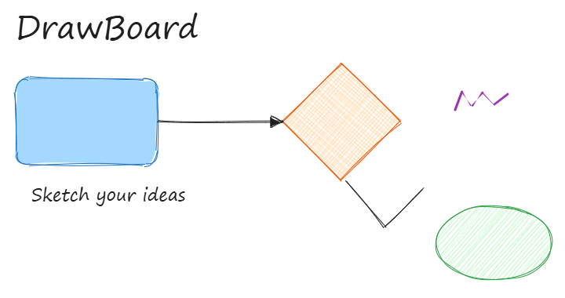

# DrawBoard

An open-source, self-hostable whiteboard inspired by [Excalidraw](https://excalidraw.com) — sketch diagrams, wireframes, and notes with a hand-drawn aesthetic. Built with React, TypeScript, HTML Canvas, and [Rough.js](https://roughjs.com/). No account, no login — everything lives in your browser (with an optional real-time collaboration mode).

**Live demo:** [draw.designpav.in](https://draw.designpav.in)
**Docs / user manual:** [draw.designpav.in/docs](https://draw.designpav.in/docs)



*More screenshots (dark mode, style panel, mobile) welcome via PR — see [Contributing](#contributing).*

## Features

- **12 tools**: selection, rectangle, diamond, ellipse, arrow (5 arrowhead styles per end), line, freehand draw, text, image insert, eraser, frame, hand/pan — with the same keyboard shortcuts as Excalidraw.
- **Full styling**: stroke & background color (presets + custom picker), fill style (hachure / cross-hatch / solid), stroke width & style, sloppiness (architect / artist / cartoonist), sharp or round edges, opacity, font family/size/alignment.
- **Selection & transform**: multi-select, 8-handle resize, rotate, group/ungroup, lock, layering (front/back/forward/backward), duplicate, arrow-key nudging.
- **Undo/redo** with a full history stack.
- **Shape library**: built-in shapes plus your own, exportable/importable as `.excalidrawlib`.
- **Import/export**: native JSON, PNG (1x/2x, transparent background), SVG, copy-to-clipboard as PNG.
- **Infinite canvas**: pan, zoom, grid toggle, dark/light theme, custom canvas background.
- **Autosave**: everything persists to your browser's IndexedDB automatically — close the tab and come back later.
- **Command palette** (`Ctrl/Cmd+K`), right-click context menu, stats panel, in-app help dialog (`Shift+/`).
- **Installable PWA** with offline app-shell caching.
- **Optional real-time collaboration**: shared cursors, presence, and live multi-user editing via [Yjs](https://yjs.dev/) — see [Collaboration](#real-time-collaboration-optional) below. (Not enabled on the public demo — see [Known limitations](#known-limitations).)
- **In-app feedback form** that emails the maintainer directly.

## Quick start

```bash
git clone https://github.com/krishundre/draw.git   # or wherever you forked it
cd draw
npm install
npm run dev
```

Open the printed `http://localhost:5173` URL. That's it.

## Building for production

```bash
npm run build      # outputs static files to dist/
npm run preview    # serve the production build locally to sanity-check it
```

`dist/` is fully static and installable as a PWA.

## Deploying

The app deploys as-is to any static host. It's built and tested against **[Vercel](https://vercel.com)**:

1. Import the GitHub repo in the Vercel dashboard (or `vercel` via the CLI).
2. Vercel auto-detects the Vite build (`npm run build`, output `dist/`) — no extra config needed.
3. If you want the in-app feedback form to send email, set the environment variables described in [`.env.example`](.env.example) (`RESEND_API_KEY`, `RESEND_FROM_EMAIL`, `FEEDBACK_TO_EMAIL`) in the Vercel project settings — the form is backed by a serverless function at `api/feedback.ts`.
4. Point a custom domain/subdomain at the Vercel project (Vercel's dashboard gives you the exact DNS record to add, typically a `CNAME`).

### Real-time collaboration (optional)

Collaboration uses Yjs over a small WebSocket relay server in `server/`. It's a **long-running Node process**, so it can't be deployed as a Vercel serverless function — run it on any always-on host (Fly.io, Railway, a VPS, etc.) and point the client at it:

```bash
npm run server                 # runs the relay on ws://localhost:1234 by default
VITE_COLLAB_WS_URL=wss://your-collab-host npm run build
```

The server doesn't persist anything itself — each browser keeps its own full copy locally (IndexedDB), so it's safe to restart at any time. Click **Share** in the app to connect and get a link containing `?room=<id>`.

## Known limitations

- SVG export currently rasterizes to PNG and wraps it in an `<svg>` — not true scalable vector output yet.
- Arrows/lines are 2-point drag-only (no multi-point click-chain editing).
- Arrow-to-shape binding (arrows that stay attached as you move a shape) isn't implemented yet.
- No Mermaid-to-diagram converter or laser pointer.
- Frames are visual/organizational only — moving a frame doesn't drag its contents yet.
- The public demo runs single-user only (see above); self-host `server/` if you want live collaboration.

Contributions welcome on any of these — see below.

## Contributing

Bug reports, feature requests, and PRs are welcome — see [CONTRIBUTING.md](CONTRIBUTING.md). Please also read the [Code of Conduct](CODE_OF_CONDUCT.md).

## License

[MIT](LICENSE) © DesignPav

## Project layout

```
src/
  canvas/       core rendering (Rough.js), geometry/hit-testing, the Canvas component, element factory
  collab/       Yjs document + WebSocket/IndexedDB providers
  components/   all UI panels (toolbar, style panel, menus, dialogs, overlays, feedback form)
  docs/         the /docs user manual — Markdown content + a small React/react-router layout that renders it
  library/      built-in shape library
  state/        Zustand store + undo/redo history stack
  tools/        tool & keyboard-shortcut definitions
  utils/        id generation, PNG/SVG/JSON export
api/
  feedback.ts   Vercel serverless function that emails feedback via Resend
server/
  index.js      minimal Yjs WebSocket relay for optional live collaboration
```

Docs live at `draw.designpav.in/docs` and deploy automatically with the app — each page is a plain Markdown file in `src/docs/content/`; add one there plus an entry in `src/docs/nav.ts` to add a new docs page.
